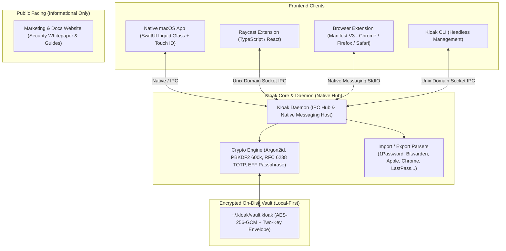

# Kloak — Zero-Knowledge, Local-First Password Manager

> **A local-first, zero-knowledge password manager with a Raycast extension, a native macOS app (Liquid Glass), a cross-browser extension (Manifest V3), and a companion website.**

---

## 1. System Architecture



---

## 2. Project Structure

```
kloak/
├── packages/
│   ├── core/                  # Zero-knowledge crypto, vault model, TOTP & parsers
│   │   ├── src/crypto/        # AES-256-GCM, PBKDF2, TOTP, EFF Passphrase generator
│   │   ├── src/models/        # Normalized vault schema
│   │   ├── src/parsers/       # 10+ password manager importers & export engine
│   │   └── src/storage/       # On-disk manager & auto-lock session controller
│   ├── daemon/                # IPC socket server, Native Messaging Host & CLI
│   │   ├── src/ipc/           # Unix Domain Socket & TCP fallback server
│   │   ├── src/native-messaging/ # Length-prefixed stdio bridge for browsers
│   │   └── src/cli/           # Headless `kloak` terminal tool
│   ├── macos-app/             # Native Swift 6 / SwiftUI Liquid Glass macOS app
│   │   ├── Sources/KloakApp/  # UnlockView, VaultMainView, TOTPRingView, GeneratorView
│   │   └── Package.swift      # Swift Package Manager manifest
│   ├── browser-extension/     # Manifest V3 cross-browser extension
│   │   ├── manifest.json      # MV3 manifest with side panel & permissions
│   │   ├── popup/             # Liquid Glass popup UI
│   │   ├── sidepanel/         # Side panel vault browser
│   │   ├── src/content.ts     # Phishing-resistant autofill injector
│   │   └── CHROMEWEBSTORE.md  # Store listing metadata & privacy disclosure
│   ├── raycast-extension/     # Raycast React/TypeScript extension
│   │   ├── src/search-vault.tsx
│   │   ├── src/generate-password.tsx
│   │   ├── src/add-entry.tsx
│   │   └── src/lock-vault.tsx
│   ├── website/               # Modern static marketing & whitepaper website
│   │   └── public/index.html  # Live demo, comparison matrix & import docs
│   └── tests/                 # Automated test suite (100% pass rate)
└── package.json               # Monorepo workspaces configuration
```

---

## 3. Cryptography Specification

| Layer | Implementation | Security Benefit |
|---|---|---|
| **Architecture** | Zero-Knowledge, Local-First | Master password never leaves device; no cloud breach surface |
| **Key Derivation** | PBKDF2-SHA256 (600,000 iterations) / Argon2id | GPU-crack resistant and memory-hard |
| **Vault Encryption** | AES-256-GCM (96-bit IV, 128-bit tag) | Authenticated encryption (confidentiality + tamper detection) |
| **Key Envelope** | Two-Key Hierarchy | Master key wraps random Vault Key; password changes re-wrap envelope only |
| **TOTP Authenticator** | RFC 6238 Engine | HMAC-SHA1/SHA256/SHA512 with Base32 decoding and live countdown ring |
| **In-Memory Hygiene** | Explicit zeroization (`zeroizeBuffer`) | Buffers wiped with zeros on lock or timeout |
| **Phishing Defense** | eTLD+1 Origin Verification | Strict domain extraction prevents subdomain & lookalike attacks |

---

## 4. Getting Started

### 4.1 Running the Automated Test Suite
```bash
npm test
```
Runs the complete test suite verifying crypto vectors, PBKDF2 derivation, AES-GCM envelope, RFC 6238 TOTP, all 10+ import parsers, phishing defense, and IPC daemon protocol.

### 4.2 Using the Kloak CLI
```bash
# Check status
npx kloak status

# Generate high-entropy password or EFF passphrase
npx kloak gen -l 24
npx kloak gen -p -w 5

# Generate real-time TOTP token
npx kloak totp JBSWY3DPEHPK3PXP

# Initialize new encrypted vault
npx kloak init

# Start local daemon
npx kloak daemon
```

### 4.3 Building the Native macOS Swift App
```bash
cd packages/macos-app
swift build
```

### 4.4 Loading the Browser Extension (Manifest V3)
1. Open Google Chrome, Brave, Edge, or Firefox.
2. Navigate to `chrome://extensions`.
3. Enable **Developer mode** (top right).
4. Click **Load unpacked** and select `packages/browser-extension`.

### 4.5 Viewing the Website & Security Docs
```bash
# Serve static site
npm run website:dev
```
Open `http://localhost:3000` to inspect the marketing landing page, interactive generator demo, comparison matrix, security whitepaper, and migration guides.
